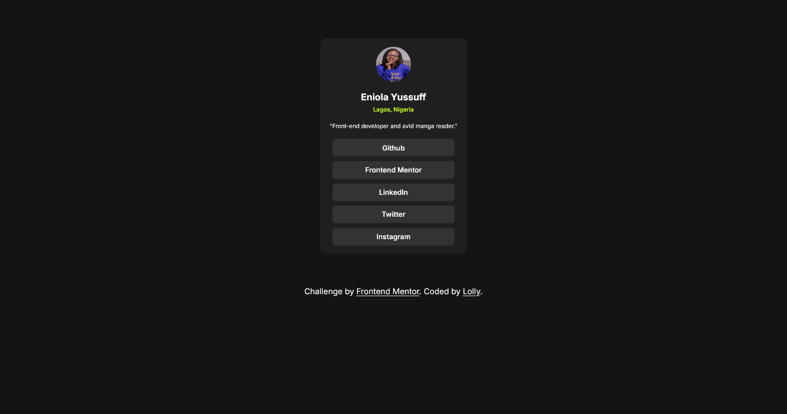

# Frontend Mentor - Social links profile solution

This is a solution to the [Social links profile challenge on Frontend Mentor](https://www.frontendmentor.io/challenges/social-links-profile-UG32l9m6dQ). Frontend Mentor challenges help you improve your coding skills by building realistic projects.

## Table of contents

- [Overview](#overview)
  - [The challenge](#the-challenge)
  - [Screenshot](#screenshot)
  - [Links](#links)
- [My process](#my-process)
  - [Built with](#built-with)
  - [What I learned](#what-i-learned)
  - [Continued development](#continued-development)
  - [Useful resources](#useful-resources)
- [Author](#author)

## Overview

### The challenge

This project is a responsive social links profile page, created as a solution to a Frontend Mentor challenge. It displays a my profile image, name, location, bio, and social media links in a simple, dark-themed card layout.

Users should be able to:

- See hover and focus states for all interactive elements on the page

### Screenshot



### Links

- Solution URL: [Social Links Profile Solution](https://github.com/Enilolade/social-links-profile)
- Live Site URL: [Live Site]([https://your-live-site-url.com](https://enilolade.github.io/social-links-profile/))

## My process

### Built with

- HTML5 for the structure
- CSS3 for styling and layout
- Flexbox
- Google Fonts (Inter) for typography

### What I learned

One unique feature I tried in this project is:

css transform

```.container {
    transform: scale(0.8);
}
```

This scales down the container slightly for laptop screens (applied in @media (min-width: 1024px)) to improve spacing and readability.

### Continued development

- Advanced CSS
- JS
- Typescript
- Git
- React

### Useful resources

- [Transform Property](https://chatgpt.com/share/67c716cd-2b74-8010-809d-de3a9eab6630) - This helped me with resizing for different screen sizes.

## Author

- Website - [Enilolade aka Lolly]
- Frontend Mentor - [@yourusername](https://www.frontendmentor.io/profile/Enilolade)
